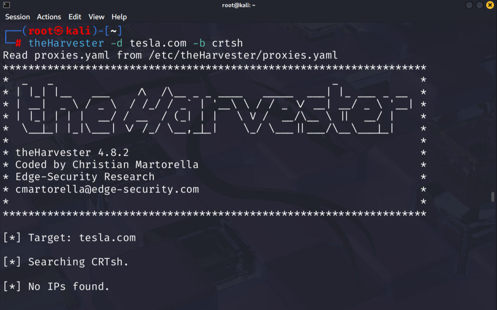
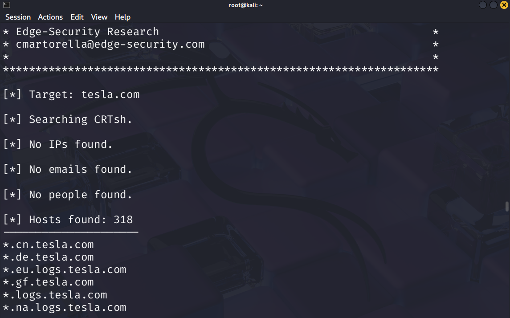

# Passive Reconnaissance using theHarvester and Certificate Transparency Logs

## Overview

So, Basically this exercise demonstrates passive reconnaissance by collecting publicly available information related to specific target domain using **theHarvester**. And, the objective was to identify exposed subdomains associated with the target organization without directly interacting with its infrastructure.

---

## Objective

    ▤ Perform passive information gathering against a target domain.

    ▤ Enumerate publicly available subdomains from Certificate Transparency (CT) logs.

---

---
---

| Component | Details |
|------------|----------|
| Operating System | Kali Linux |
| Tool | theHarvester v4.8.2 |
| Data Source | CRT.sh (Certificate Transparency Logs) |

---


**Domain:** `tesla.com`

---

### Command Used

```bash
theHarvester -d tesla.com -b crtsh
```

---

## Results

### Summary

| Item | Count |
|--------|--------|
| IP Addresses | 0 |
| Email Addresses | 0 |
| People | 0 |
| Hosts/Subdomains | 318 |

### Sample Discovered Hosts

```text
*.cn.tesla.com
*.de.tesla.com
*.eu.logs.tesla.com
*.gf.tesla.com
*.logs.tesla.com
*.na.logs.tesla.com
*.nv.tesla.com
*.ny.tesla.com
```

---

## Analysis

Certificate Transparency (CT) logs maintain publicly accessible records of issued SSL/TLS certificates. By querying these records, it is possible to identify publicly known hostnames and subdomains associated with a target organization.

TheHarvester successfully identified 318 host entries associated with the target domain.

---

### Security Relevance


- Identify publicly exposed assets.
- Discover regional and service-specific infrastructure.
- Build an inventory of potential targets for further assessment.

But, this exercise was limited to passive information gathering using publicly available sources and did not involve any sort of interaction with any  target systems, 


---

## Screenshots

### Command Execution



### Enumeration Results



